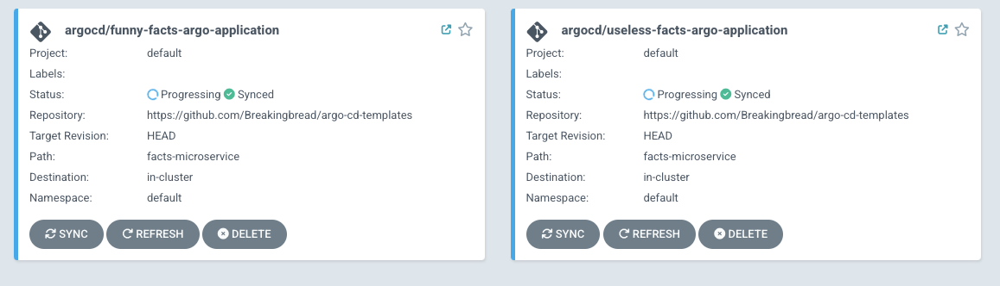
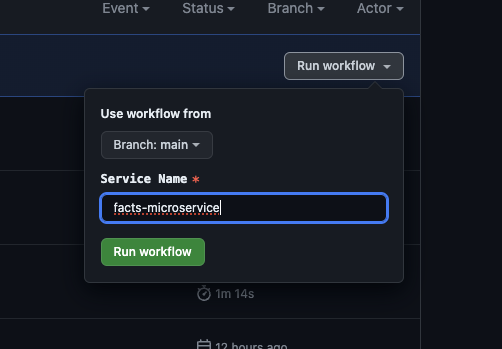
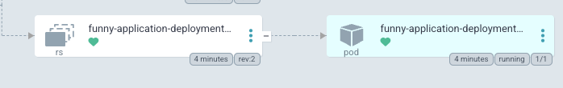
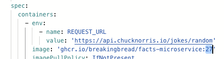

# Guide

This documentation repository contains a description of developed modules.


## Microservice
**Task**: A simple web app that consumes a url from an environment variable, then sends an api request to the given url and returns the response as an http response.  The codebase should be generic, and should be able to consume any url and return its response.
- "«domain-1>/uselessfact" should make an api request to (https://uselessfacts.jsph.pl) and return a random fact as response;
- "‹domain-2>/funnyfact" should make an api request to  
  (https://api.chucknorris.io/) and return a random chuck norris joke as response;
- "/ready" should response status code 200.
___
**Solution**: [Application](https://github.com/Breakingbread/facts-application) takes REQUEST_URL from environment as variable and then passes to endpoint functions, which are using *forwardRequest* generic function to make request and return response to endpoint function.

	r.GET("/uselessfact", func(c *gin.Context) {
		resp, err := forwardRequest(*setting.AppSetting)
		**CODE**
	})

    func forwardRequest(app setting.App) (map[string]interface{}, error) {
	resp, err := http.Get(app.RequestUrl)
	if err != nil {
		return nil, err
	}

	defer resp.Body.Close()

	var result map[string]interface{}
	if err := json.NewDecoder(resp.Body).Decode(&result); err != nil {
		return nil, err
	}

	return result, err
	}
**Workflow**: [Pipeline](https://github.com/Breakingbread/facts-application/blob/main/.github/workflows/publish-image.yml) builds and pushes image to Github Packages. In case if push is successful it triggers argo-cd-templates repository event, transmitting the tag/version of newly builded image.

          - name: Trigger helm version patch pipeline
        run: |
          curl -L -X POST https://api.github.com/repos/${{ steps.organization.outputs.lowercase }}/argo-cd-templates/dispatches \
          -H "Accept: application/vnd.github.everest-preview+json" \
          -H "Authorization: Bearer ${{ secrets.PAT }}" \
          -H "X-GitHub-Api-Version: 2022-11-28" \
          --data '{"event_type": "patch_version", "client_payload": {"version": ${{ env.BUILD_NUMBER }}}}' 


## Infrastructure
[Terraform configuration](https://github.com/Breakingbread/infrastructure) creates EKS cluster with all required dependencies, installs Argo CD immediately upon cluster creation.
Note: Basis was taken from [Blueprints repository](https://github.com/aws-ia/terraform-aws-eks-blueprints/tree/main/examples/argocd) and modified.


    module "eks_blueprints_addons" {
      source = "github.com/aws-ia/terraform-aws-eks-blueprints//modules/kubernetes-addons?ref=v4.32.1"
    
      eks_cluster_id        = module.eks.cluster_name
      eks_cluster_endpoint  = module.eks.cluster_endpoint
      eks_cluster_version   = module.eks.cluster_version
      eks_oidc_provider     = module.eks.oidc_provider
      eks_oidc_provider_arn = module.eks.oidc_provider_arn
    
      argocd_helm_config = {
        set_sensitive = [
          {
            name  = "configs.secret.argocdServerAdminPassword"
            value = bcrypt_hash.argo.id
          }
        ]
      }
    
    
      enable_argocd = true
    
      enable_argo_rollouts                 = true
    
      tags = local.tags
    }

## Templates

[Repository](https://github.com/Breakingbread/argo-cd-templates) with helm-templates that is tracked by Argo CD. Consist of templates: ingress, deployment, service; value files.
**Workflow**: [Pipeline](https://github.com/Breakingbread/argo-cd-templates/blob/main/.github/workflows/patch-helm.yaml) triggers after successful build and push of new application image. It receives payload and changes version of appVersion.

      - name: Parse payload
        run: |
          echo "version=${{ github.event.client_payload.version }}" >> "$GITHUB_ENV"
          echo "Application Version: $version"
    
      - name: Patch helm
        env:
          GITHUB_TOKEN: ${{ secrets.GITHUB_TOKEN }}
        run: |
          sed -i "s/appVersion:.*/appVersion: $version/" facts-microservice/Chart.yaml
          git config user.name "GitHub Actions"
          git config user.email "actions@github.com"
          git add facts-microservice/Chart.yaml
          git commit -m "Update appVersion to $version"
          git push

appVersion is used as a tag in deployment template.

    spec:
      containers:
        - name: facts-microservice
          image: "{{ .Values.image.repository }}:{{ .Chart.AppVersion }}"
These actions allow Argo CD to update an old deployments with a new image version.

## Running the exercise

1. **Deploying infrastructure**

Clone the [infrastructure repository](https://github.com/Breakingbread/infrastructure). Create terraform.tfvars file that is containing all the necessary variables.

    terraform apply

After successful creation of resources update kubeconfig.

    aws eks --region <REGION> update-kubeconfig --name <CLUSTER_NAME> --alias <CLUSTER_NAME>

Configure port-forwarding in order to access Argo CD admin panel.

    kubectl port-forward svc/argo-cd-argocd-server 8080:443 -n argocd

Then, open your browser and navigate to  `https://localhost:8080/`  Username should be  `admin`. Retrieve the password.

    aws secretsmanager get-secret-value --secret-id <SECRET_NAME>--region <REGION>

2. **Deploying application**

Clone the [argo-cd-templates repository](https://github.com/Breakingbread/argo-cd-templates). To deploy applications simply run command, being in the root folder of repository:

    kubectl apply -f .


Desired output. 


In order to verify if Argo CD pulls new changes, create a new build by microservice pipeline.



Pipelines changes the version to a new one.


Argo CD creates new revision.



Verifying LIVE Manifest of new revision.



3. **Destroying**

To teardown and remove the resources created in this example:

First, ensure that the ArgoCD applications are properly cleaned up from the cluster, this can be achieved in multiple ways:

1) Disabling the `argocd_applications` configuration and running `terraform apply` again
2) Deleting the apps using `argocd` [cli](https://argo-cd.readthedocs.io/en/stable/user-guide/app_deletion/#deletion-using-argocd)
3) Deleting the apps using `kubectl` following [ArgoCD guidance](https://argo-cd.readthedocs.io/en/stable/user-guide/app_deletion/#deletion-using-kubectl)

Then you can start delete the terraform resources:
```sh
terraform destroy -target=module.eks_blueprints_kubernetes_addons -auto-approve
terraform destroy -target=module.eks -auto-approve
terraform destroy -auto-approve
````


